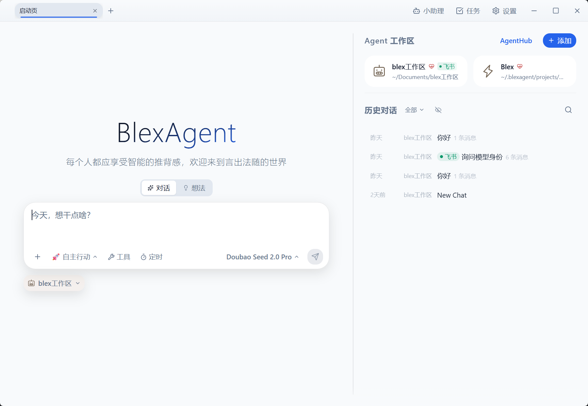
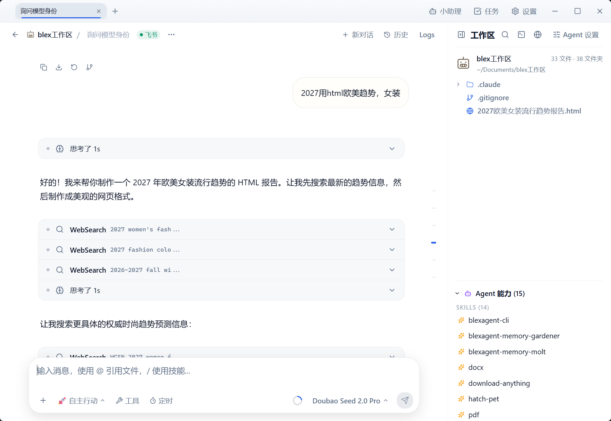
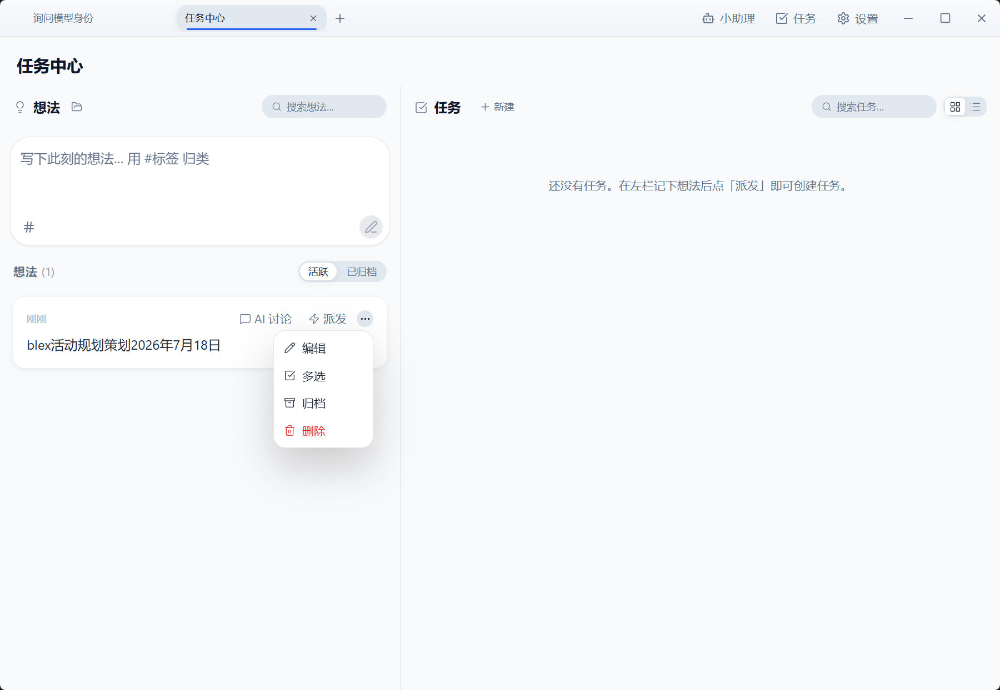
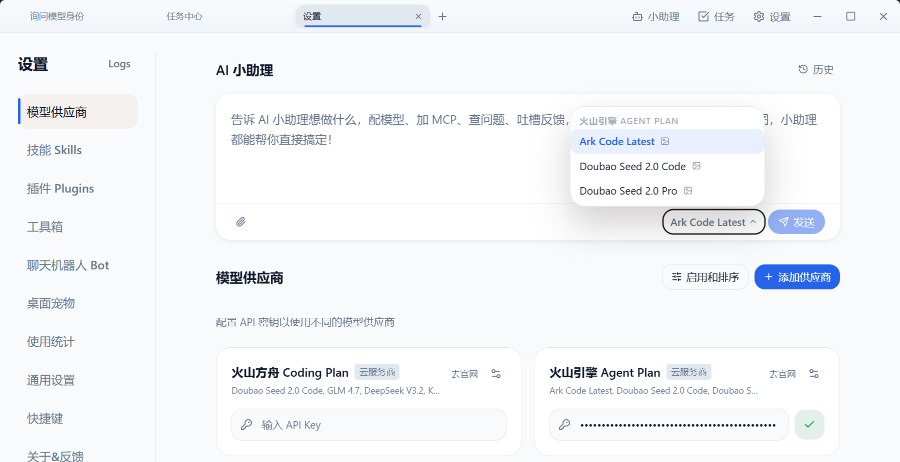

# BlexAgent

**活在你的电脑里，真正能帮你完成事情的个人 Agent**

[官网](https://blexagent.com) · [下载](https://blexagent.com) · [使用支持](SUPPORT.md) · [安全](SECURITY.md) · [隐私](specs/legal/PRIVACY.md) · [许可](LICENSE) · [English](README.en.md)

## BlexAgent 是什么

BlexAgent 是杭州波粒二象文化科技有限公司开发的 Apache-2.0 开源桌面 Agent。它把对话、工作区、文件、模型、工具、任务、长期记忆和聊天机器人连接在同一个应用中，让 AI 不只回答问题，还能围绕真实资料持续完成工作。

BlexAgent 面向内容创作者、教育工作者、学生、家庭用户、知识工作者和希望改善日常效率的人。你不需要安装或学习命令行 AI 工具；应用使用内置的 Claude Agent SDK 运行 Agent，并通过图形界面提供配置、执行和审查能力。

当前 `0.7.x` 属于预览版本。预览版用于功能验证；官方发行包将完成平台代码签名、macOS 公证和更新签名。开源许可不代表任意构建都是官方发行版，安装包请核对发布来源、签名和校验值。

## 你可以用它做什么

### 围绕真实资料持续工作

每个 Agent 都可以绑定一个本地工作区。你可以让它阅读和整理资料、创作文案、制作计划、分析文件、调用工具，并在后续对话中继续使用已有上下文。

- 多标签页同时处理不同主题。
- 在工作区中预览、搜索和管理文件。
- 使用 `@` 引用文件，使用 `/` 调用经过安装的 Skill。
- 通过火山引擎 Agent Plan 选择适合当前任务的模型。
- 对工具调用、文件修改和敏感操作保留可见的确认边界。

### 把想法变成可以追踪的任务

BlexAgent 内置想法与任务中心。零散念头可以先被记录、讨论和整理，再转化为一次性任务、周期任务或定时执行计划。

- 想法记录、标签和归档。
- 任务目标、执行状态和结果验收。
- 一次性、周期性和 Cron 调度。
- 运行记录、失败信息和后续复盘。

### 从 AgentHub 选择经过审核的模板

AgentHub 提供由 BlexAgent 团队审核的 Agent 模板和 Skill，覆盖创作、生活、教育、知识管理、个人效率等方向。模板随应用提供或由官方受控渠道分发，用户不需要访问 GitHub、配置 VPN 或运行安装命令。

模板进入 AgentHub 前需要通过来源、许可证、安全性、隐私和内容质量审核。详见 [AgentHub 内容政策](AGENTHUB_CONTENT_POLICY.md)。

### 携手火山引擎 Agent Plan

BlexAgent 携手火山引擎 Agent Plan，为创作者、教育工作者和日常用户提供稳定、便捷的智能模型体验。用户无需研究复杂的模型接入方式，即可在应用内完成配置，并从经过精选的模型中选择适合当前任务的一项。

- **Agent Plan 优先体验**：围绕火山引擎 Agent Plan 设计清晰、统一的配置与模型选择流程。
- **精选模型**：提供 Ark Code Latest、Doubao Seed 2.0 Code、Doubao Seed 2.0 Pro 等面向不同任务的模型选择，实际可用范围以应用内页面为准。
- **面向真实工作**：模型能力与工作区、文件、任务、Skills 和 AgentHub 协同，不只是独立的聊天入口。

模型之外，BlexAgent 还可以连接经过用户授权的工具和聊天平台：

- **MCP**：连接经过用户授权的外部工具和数据源。
- **Skills**：把稳定流程沉淀为可复用能力。
- **自定义 Agent**：为不同工作区设置不同提示词、工具和权限。
- **聊天机器人 Channel**：支持飞书、钉钉及经过审核的 OpenClaw Channel 插件。
- **飞书扫码创建**：在支持的配置流程中扫码创建并绑定飞书应用。

## 数据与隐私

BlexAgent 采用本地优先设计：应用配置、对话、任务、日志和工作区引用默认保存在本机。使用模型供应商、MCP、网页、飞书、钉钉或插件时，完成该操作所需的提示词、上下文、文件、消息或元数据可能被发送给相应第三方。

在启用外部服务前，请检查其权限和隐私条款，不要向没有授权的模型或工具发送秘密、个人信息或受限制资料。完整说明见 [BlexAgent 隐私声明](specs/legal/PRIVACY.md)。

## 系统要求与发行状态

| 平台 | 预览版目标 | 正式发行要求 |
| --- | --- | --- |
| macOS | macOS 13 或更高版本；Apple Silicon 优先验证 | Developer ID 签名、Apple 公证、安装与更新验证 |
| Windows | Windows 10 或更高版本 | 可信发布者代码签名、安装与更新验证 |

仅从 [BlexAgent 官网](https://blexagent.com) 或明确标记的官方发布位置获取安装包。无签名、未公证或标记为 internal/preview 的构建只用于测试。

## 支持与安全

- 使用和安装问题：[support@blexagent.com](mailto:support@blexagent.com)
- 安全漏洞：[security@blexagent.com](mailto:security@blexagent.com)
- 隐私请求：[privacy@blexagent.com](mailto:privacy@blexagent.com)
- 许可与法律：[legal@blexagent.com](mailto:legal@blexagent.com)

请不要通过公开 Issue 提交漏洞、API Key、聊天记录、用户数据或其他敏感信息。详细流程见 [SECURITY.md](SECURITY.md) 和 [SUPPORT.md](SUPPORT.md)。

## 开源许可与品牌

BlexAgent 源代码及官方构建中属于本项目的材料采用 [Apache License 2.0](LICENSE)；归属声明见 [NOTICE](NOTICE)，第三方组件继续适用各自许可证，详见[第三方软件声明](THIRD_PARTY_NOTICES.md)。官方发行版的使用说明不会限制 Apache-2.0 已授予的源代码和目标代码权利。

“BlexAgent”名称和标识归杭州波粒二象文化科技有限公司所有。Apache-2.0 不授予商标使用许可；社区构建和衍生版本不得冒充公司签名的官方安装包。详见[品牌政策](TRADEMARKS.md)，欢迎阅读 [CONTRIBUTING.md](CONTRIBUTING.md) 参与贡献。
